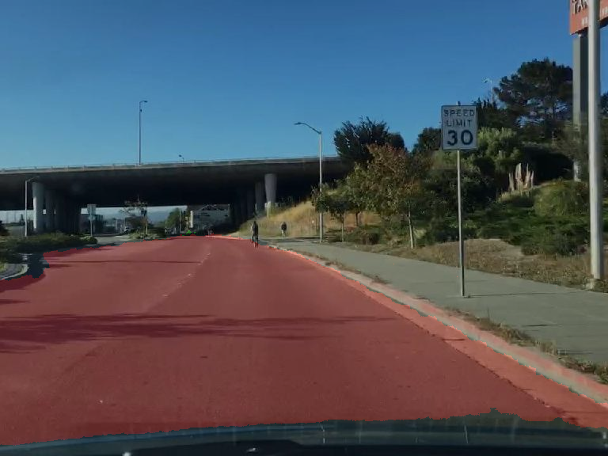

# Semantic Segmentation

## Inroduction

This work involves the use of an encoder decoder architecture CNN for semantic segmentation of the image. We took inspiration from  [LinkNet](https://arxiv.org/abs/1707.03718) for the same and trained our model oon both the mapillary dataset and the Berkley Deep Drive dataset.

https://drive.google.com/file/d/1WFPjmI9Tx_5_-UgVa2A2-6RhbGRrl2Zt/view?usp=sharing

## Usage

### Training/Testing

For training or testing please keep all your RGB images and their corresponding ground truths in separate folders but bearing the same name. The input image must be a jpg and the ground truth must be a greyscale png with each pixel value being its anootated class index value.

For training use the following

```  bash
foo@bar$ python3 all_linknet.py -m <any of the legal modes> 
```

The checkpoint will be stored in the ./model_files directory. Feel free to train it yourself or you could use one of our [checkpoints](www.checkpoint.com) for the same.

## Results

|    |   |  |
| --------------------- | --------------------- | --------------------- |
|  |  |  |
|  |  |  |

